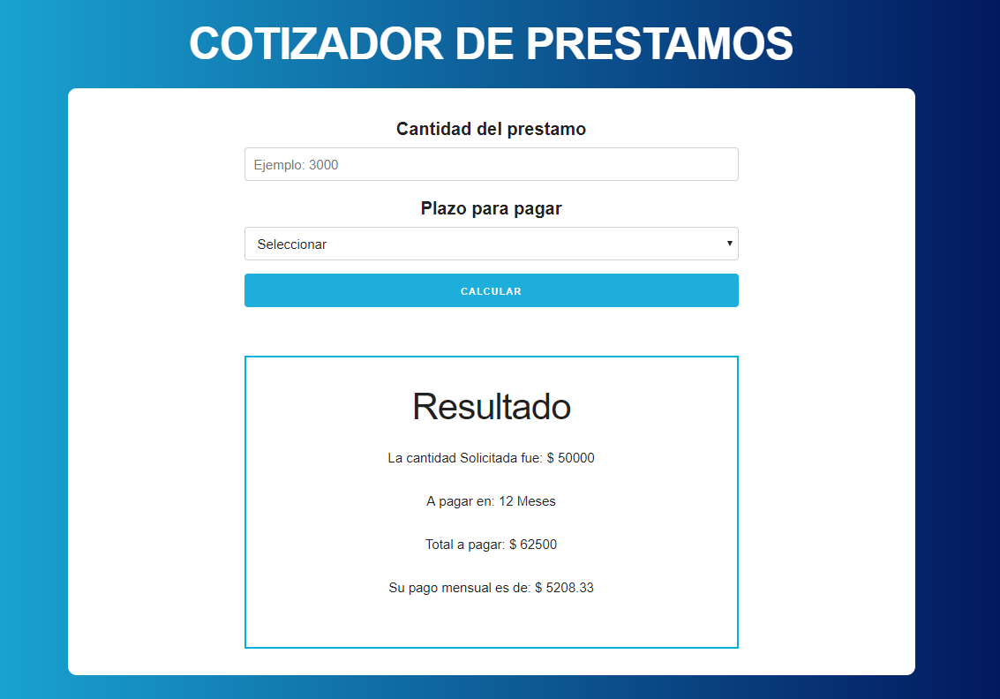

   

    
<h6 align = "center">SigmaΣCode</h6>

<h1 align="center">Loan Quoter</h1>
<h2 align="center">Cotizador de Prestamos</h2>

 React Application.

 

## Captures

    

## Features

- Reactive form.
- ReactJS.
- Bootstrap Classes.

## See it online

- [`netlify`](https://cotizadordeprestamos.netlify.com)  

## Links to other proyects

- [`Final Fantasy VII Menu`](https://github.com/LeonAGA/Final_Fantasy_VII_Menu)
- [`BlackBoard`](https://github.com/LeonAGA/Blackboard)
- [`Agenda`](https://github.com/LeonAGA/Agenda)    
- [`Message Box `](https://github.com/LeonAGA/Message_Box_LocalStorage)    
